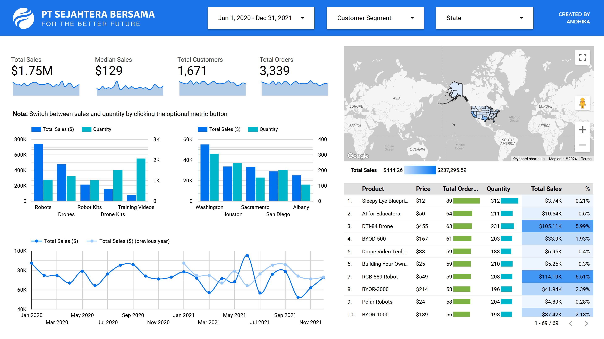
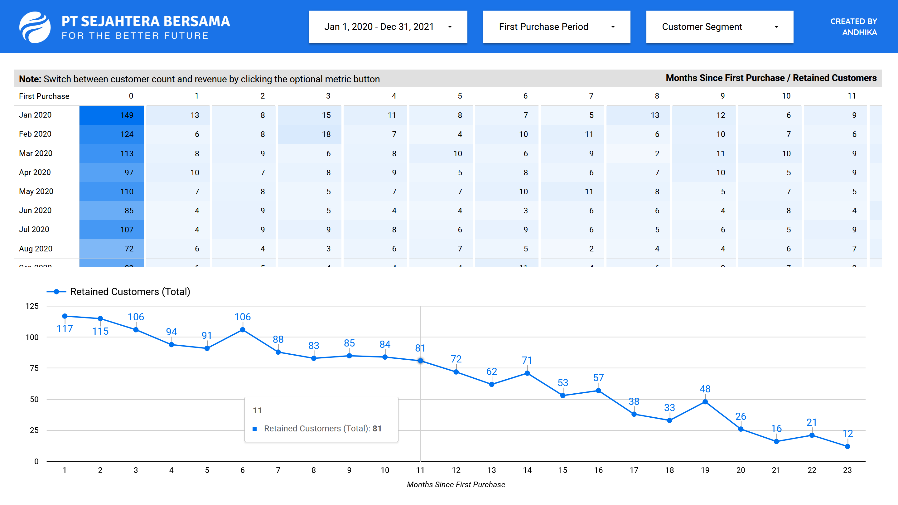
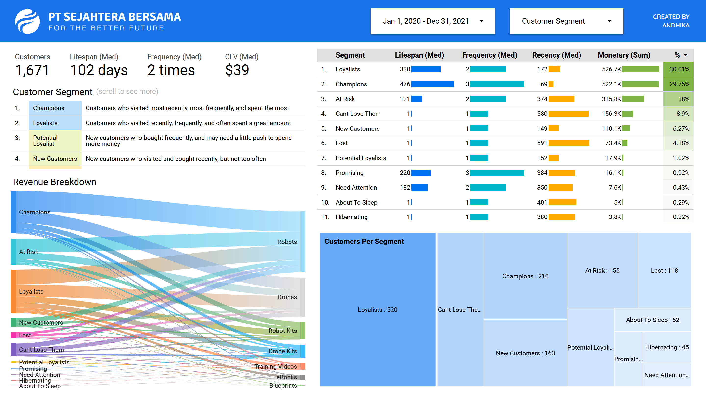

# PT Sejahtera Bersama Sales Analysis

Sales analysis using data provided by Rakamin & Bank Muamalat. **Disclaimer:** I'm not afiliated nor part of their internship program, I'm just using their data to see what can I improve from other people's work

Stacks Used:
- Docker (Gcloud CLI)
- BigQuery SQL
- Looker Studio
- R

Analysis Includes:

- General analysis (geomap, etc)
- Cohort (user & revenue retention)
- RFM, tenure, and CLV

## Notebook

For the detailed steps and explanation, please see [notebook.md](notebook.md) (compiled using [Quarto](https://quarto.org/))

It's fully reproducible, automated, and contains all the underlaying data behind the dashboard

## Looker

Dashboard link is semi-private (given per request basis). However, here are the screenshots:

