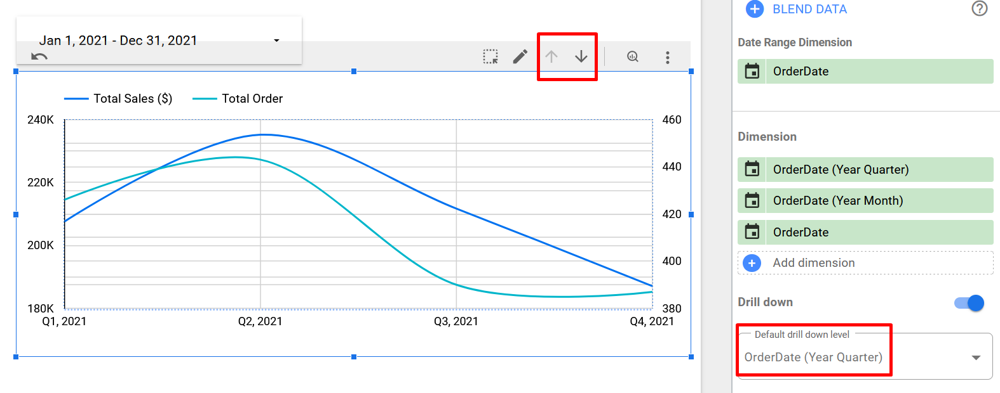

# Sales Analysis

AndhikaWB \
August 11, 2024

# BigQuery

## Set Up Docker Container

Bundle the official [gcloud Docker
image](https://cloud.google.com/sdk/docs/downloads-docker) with our CSV
data

``` sh
# Build only if the image doesn't exist yet
# Must be on the same dir as the Dockerfile
if [ ! "$(docker images -q bq-image)" ]; then
  docker build -t bq-image .
fi
```

Run the container with name `bqc`

``` sh
if [ ! "$(docker ps -qa -f name=bqc)" ]; then
  docker run -dit --name bqc bq-image
else
  docker start bqc
fi
```

    bqc

## Set Up Gcloud and Project

Run the auth process to generate login info (if you don’t have the
credentials already)

**Note:** Run it manually on your terminal, Quarto doesn’t support
interactive input

``` sh
docker exec -it bqc sh -c "gcloud auth login"
```

Set the current active account after login

**Note:** Set the email by editing `_environment` file. The output of
this code is hidden to prevent email leakage

``` sh
# Check authenticated account list
docker exec bqc sh -c "gcloud auth list"
# Set current active account (using email)
docker exec -e USER_EMAIL=$USER_EMAIL bqc sh -c "gcloud config set account $USER_EMAIL"
```

Set the project ID. You may need to create a [Google
Cloud](https://console.cloud.google.com) project first and copy the ID

``` sh
docker exec bqc sh -c "gcloud config set project mumu-431300"
```

    Updated property [core/project].

## Prepare SQL Tables

[Enable BigQuery
API](https://console.cloud.google.com/marketplace/product/google/bigquery.googleapis.com)
on your project, then we can make (`mk`) a sample
[dataset](https://cloud.google.com/bigquery/docs/datasets) called
`sales_data`

You can also override project ID manually via `--project_id=XXX`
parameter

``` sh
docker exec bqc sh -c "bq --location=asia-southeast1 mk sales_data"
```

    BigQuery error in mk operation: Dataset 'mumu-431300:sales_data' already exists.

[Import
CSV](https://cloud.google.com/bigquery/docs/loading-data-cloud-storage-csv)
files (as tables) to `sales_data` dataset. Use `--autodetect` to figure
out table schema types automatically

``` sh
docker exec bqc sh -c "
  bq load --replace --autodetect --source_format=CSV sales_data.customer customers.csv
  bq load --replace --autodetect --source_format=CSV sales_data.order orders.csv
  bq load --replace --autodetect --source_format=CSV sales_data.product products.csv
  bq load --replace --autodetect --source_format=CSV sales_data.productcategory productcategory.csv
"
```


    Upload complete.

    Waiting on bqjob_r3da04d31081c17a6_00000191401f885c_1 ... (0s) Current status: RUNNING
                                                                                          
    Waiting on bqjob_r3da04d31081c17a6_00000191401f885c_1 ... (1s) Current status: RUNNING
                                                                                          
    Waiting on bqjob_r3da04d31081c17a6_00000191401f885c_1 ... (1s) Current status: DONE   

    Upload complete.

    Waiting on bqjob_r5334e706cd205968_00000191401fa379_1 ... (0s) Current status: RUNNING
                                                                                          
    Waiting on bqjob_r5334e706cd205968_00000191401fa379_1 ... (1s) Current status: RUNNING
                                                                                          
    Waiting on bqjob_r5334e706cd205968_00000191401fa379_1 ... (1s) Current status: DONE   

    Upload complete.

    Waiting on bqjob_r7b992bcad26b0ba5_00000191401fbdce_1 ... (0s) Current status: RUNNING
                                                                                          
    Waiting on bqjob_r7b992bcad26b0ba5_00000191401fbdce_1 ... (1s) Current status: RUNNING
                                                                                          
    Waiting on bqjob_r7b992bcad26b0ba5_00000191401fbdce_1 ... (1s) Current status: DONE   

    Upload complete.

    Waiting on bqjob_r3752ce12f7a91bb3_00000191401fd565_1 ... (0s) Current status: RUNNING
                                                                                          
    Waiting on bqjob_r3752ce12f7a91bb3_00000191401fd565_1 ... (1s) Current status: RUNNING
                                                                                          
    Waiting on bqjob_r3752ce12f7a91bb3_00000191401fd565_1 ... (1s) Current status: DONE   

Run a test query by checking the `order` table, and see whether
`OrderID` is unique or not

``` sh
docker exec bqc sh -c '
  bq query --use_legacy_sql=false "
    SELECT * FROM sales_data.order LIMIT 1;

    SELECT
      COUNT(*) AS count_row,
      COUNT(DISTINCT OrderID) AS count_order
    FROM
      sales_data.order
  "
'
```


    Waiting on bqjob_r5b776e654b1b165_00000191401ff2c1_1 ... (0s) Current status: RUNNING
                                                                                         
    Waiting on bqjob_r5b776e654b1b165_00000191401ff2c1_1 ... (1s) Current status: RUNNING
                                                                                         
    Waiting on bqjob_r5b776e654b1b165_00000191401ff2c1_1 ... (2s) Current status: RUNNING
                                                                                         
    Waiting on bqjob_r5b776e654b1b165_00000191401ff2c1_1 ... (2s) Current status: DONE   
    SELECT * FROM sales_data.order LIMIT 1; -- at [2:5]
    +---------+------------+------------+------------+----------+
    | OrderID |    Date    | CustomerID | ProdNumber | Quantity |
    +---------+------------+------------+------------+----------+
    |    1758 | 2021-01-15 |        923 | BP101      |        1 |
    +---------+------------+------------+------------+----------+
    SELECT
          COUNT(*) AS count_row,
          COUNT(DISTINCT OrderID) AS count_order
        FROM
          sales_data.order; -- at [4:5]
    +-----------+-------------+
    | count_row | count_order |
    +-----------+-------------+
    |      3339 |        3339 |
    +-----------+-------------+

That works, and we can see that `OrderID` is unique

However, the command is too long and doesn’t have syntax highlighting,
so we will set up a native SQL solution using the `bigrquery` library

**Note:** You need R installed to make this work

``` r
library(DBI)
library(bigrquery)

cred_file <- paste0(
  'docker/root/.config/gcloud/legacy_credentials/',
  Sys.getenv('USER_EMAIL'), '/adc.json'
)

Sys.setenv(GOOGLE_APPLICATION_CREDENTIALS = cred_file)
bq_auth()

con <- dbConnect(
  bigquery(), 
  dataset = 'sales_data', 
  project = 'mumu-431300', 
  use_legacy_sql = FALSE
)

# Set default SQL "connection" cell option
knitr::opts_chunk$set(connection = con)

# Print query result as text instead of markdown table
knitr::opts_knit$set(sql.print = function(x) {
  paste('   ', knitr::kable(x, format = 'simple'), collapse = '\n')
})
```

Now we test the SQL query again, but this time using native SQL

``` sql
SELECT * FROM sales_data.order LIMIT 1;

SELECT
  COUNT(*) AS count_row,
  COUNT(DISTINCT OrderID) AS count_order
FROM
  sales_data.order
```

     count_row   count_order
    ----------  ------------
          3339          3339

Notice that only the last query will be outputed if you’re using this
method, which differs from the `bq` tool

We can also check the table schemas in case there is an incorrect data
type

**Note:** Use `max.print: X` (cell option) rather than SQL `LIMIT X` to
change the row numbers. Though `LIMIT X` may still be useful in case
you’re billed per query

``` sql
SELECT
  table_name, column_name, data_type, is_nullable
FROM
  sales_data.INFORMATION_SCHEMA.COLUMNS
```

    table_name        column_name             data_type   is_nullable 
    ----------------  ----------------------  ----------  ------------
    rfm_desc          RFMSegment              STRING      YES         
    rfm_desc          Description             STRING      YES         
    master_table      CustomerID              INT64       YES         
    master_table      FirstName               STRING      YES         
    master_table      LastName                STRING      YES         
    master_table      CustomerCity            STRING      YES         
    master_table      CustomerState           STRING      YES         
    master_table      CustomerZip             INT64       YES         
    master_table      OrderID                 INT64       YES         
    master_table      OrderDate               DATE        YES         
    master_table      OrderProdNumber         STRING      YES         
    master_table      OrderProdName           STRING      YES         
    master_table      OrderCategoryName       STRING      YES         
    master_table      OrderPrice              FLOAT64     YES         
    master_table      OrderQuantity           INT64       YES         
    master_table      OrderTotalPrice         FLOAT64     YES         
    master_table      OrderFirstTime          BOOL        YES         
    rfm_table         CustomerID              INT64       YES         
    rfm_table         FirstName               STRING      YES         
    rfm_table         LastName                STRING      YES         
    rfm_table         CustomerCity            STRING      YES         
    rfm_table         CustomerState           STRING      YES         
    rfm_table         CustomerZip             INT64       YES         
    rfm_table         OrderID                 INT64       YES         
    rfm_table         OrderDate               DATE        YES         
    rfm_table         OrderProdNumber         STRING      YES         
    rfm_table         OrderProdName           STRING      YES         
    rfm_table         OrderCategoryName       STRING      YES         
    rfm_table         OrderPrice              FLOAT64     YES         
    rfm_table         OrderQuantity           INT64       YES         
    rfm_table         OrderTotalPrice         FLOAT64     YES         
    rfm_table         OrderFirstTime          BOOL        YES         
    cohort_pivot      FirstCohortMY           STRING      YES         
    cohort_pivot      Count_0                 INT64       YES         
    cohort_pivot      Revenue_0               FLOAT64     YES         
    cohort_pivot      Count_1                 INT64       YES         
    cohort_pivot      Revenue_1               FLOAT64     YES         
    cohort_pivot      Count_2                 INT64       YES         
    cohort_pivot      Revenue_2               FLOAT64     YES         
    cohort_pivot      Count_3                 INT64       YES         
    cohort_pivot      Revenue_3               FLOAT64     YES         
    cohort_pivot      Count_4                 INT64       YES         
    cohort_pivot      Revenue_4               FLOAT64     YES         
    cohort_pivot      Count_5                 INT64       YES         
    cohort_pivot      Revenue_5               FLOAT64     YES         
    cohort_pivot      Count_6                 INT64       YES         
    cohort_pivot      Revenue_6               FLOAT64     YES         
    cohort_pivot      Count_7                 INT64       YES         
    cohort_pivot      Revenue_7               FLOAT64     YES         
    cohort_pivot      Count_8                 INT64       YES         
    cohort_pivot      Revenue_8               FLOAT64     YES         
    cohort_pivot      Count_9                 INT64       YES         
    cohort_pivot      Revenue_9               FLOAT64     YES         
    cohort_pivot      Count_10                INT64       YES         
    cohort_pivot      Revenue_10              FLOAT64     YES         
    cohort_pivot      Count_11                INT64       YES         
    cohort_pivot      Revenue_11              FLOAT64     YES         
    cohort_pivot      Count_12                INT64       YES         
    cohort_pivot      Revenue_12              FLOAT64     YES         
    cohort_pivot      Count_13                INT64       YES         
    cohort_pivot      Revenue_13              FLOAT64     YES         
    cohort_pivot      Count_14                INT64       YES         
    cohort_pivot      Revenue_14              FLOAT64     YES         
    cohort_pivot      Count_15                INT64       YES         
    cohort_pivot      Revenue_15              FLOAT64     YES         
    cohort_pivot      Count_16                INT64       YES         
    cohort_pivot      Revenue_16              FLOAT64     YES         
    cohort_pivot      Count_17                INT64       YES         
    cohort_pivot      Revenue_17              FLOAT64     YES         
    cohort_pivot      Count_18                INT64       YES         
    cohort_pivot      Revenue_18              FLOAT64     YES         
    cohort_pivot      Count_19                INT64       YES         
    cohort_pivot      Revenue_19              FLOAT64     YES         
    cohort_pivot      Count_20                INT64       YES         
    cohort_pivot      Revenue_20              FLOAT64     YES         
    cohort_pivot      Count_21                INT64       YES         
    cohort_pivot      Revenue_21              FLOAT64     YES         
    cohort_pivot      Count_22                INT64       YES         
    cohort_pivot      Revenue_22              FLOAT64     YES         
    cohort_pivot      Count_23                INT64       YES         
    cohort_pivot      Revenue_23              FLOAT64     YES         
    cohort            CustomerID              INT64       YES         
    cohort            RFMSegment              STRING      YES         
    cohort            OrderID                 INT64       YES         
    cohort            OrderTotalPrice         FLOAT64     YES         
    cohort            FirstCohort             DATE        YES         
    cohort            FirstCohortMY           STRING      YES         
    cohort            FirstCohortCount        INT64       YES         
    cohort            FirstCohortRevenue      FLOAT64     YES         
    cohort            CurrentCohort           DATE        YES         
    cohort            CurrentCohortMY         STRING      YES         
    cohort            CurrentCohortCount      INT64       YES         
    cohort            CurrentCohortRevenue    FLOAT64     YES         
    cohort            CurrentCohortDistance   INT64       YES         
    order             OrderID                 INT64       YES         
    order             Date                    DATE        YES         
    order             CustomerID              INT64       YES         
    order             ProdNumber              STRING      YES         
    order             Quantity                INT64       YES         
    productcategory   CategoryID              INT64       YES         

Seems like all data types are already correct

Then we can start visualizing the relationship between each table using
Mermaid’s ER diagram


### Create Transaction Table

Combine all the tables onto 1 master table (let’s call it `transaction`)

``` sql
-- Join product with product category
WITH product_detail AS (
  SELECT
    p.ProdNumber,
    p.ProdName,
    pc.CategoryName,
    p.Price
  FROM sales_data.product AS p
  INNER JOIN sales_data.productcategory AS pc
  ON p.Category = pc.CategoryID
),

-- Join order with product detail
order_detail AS (
  SELECT
    o.OrderID,
    o.Date,
    o.CustomerID,
    pd.ProdNumber,
    pd.ProdName,
    pd.CategoryName,
    pd.Price,
    o.Quantity,
    -- Calculate the total price
    pd.Price * o.Quantity AS TotalPrice,
    -- Mark the first purchase of each customer
    -- OrderID is unique so we only need to check the date
    ROW_NUMBER() OVER(
      PARTITION BY o.CustomerID
      ORDER BY o.Date
    ) = 1 AS FirstTime
  FROM sales_data.order AS o
  INNER JOIN product_detail AS pd
  ON o.ProdNumber = pd.ProdNumber
),

-- Join order detail with customer
transaction AS (
  SELECT
    c.CustomerID,
    c.FirstName,
    c.LastName,
    c.CustomerCity,
    c.CustomerState,
    c.CustomerZip,
    od.OrderID,
    od.Date AS OrderDate,
    od.ProdNumber AS OrderProdNumber,
    od.ProdName AS OrderProdName,
    od.CategoryName AS OrderCategoryName,
    od.Price AS OrderPrice,
    od.Quantity AS OrderQuantity,
    od.TotalPrice AS OrderTotalPrice,
    od.FirstTime AS OrderFirstTime
  FROM sales_data.customer AS c
  INNER JOIN order_detail AS od
  ON c.CustomerID = od.CustomerID
)

SELECT * FROM transaction ORDER BY OrderDate
```

     CustomerID  FirstName    LastName    CustomerCity       CustomerState    CustomerZip   OrderID  OrderDate    OrderProdNumber   OrderProdName             OrderCategoryName    OrderPrice   OrderQuantity   OrderTotalPrice  OrderFirstTime 
    -----------  -----------  ----------  -----------------  --------------  ------------  --------  -----------  ----------------  ------------------------  ------------------  -----------  --------------  ----------------  ---------------
            422  Lucita       Lesper      Des Moines         Iowa                   50315         5  2020-01-01   EB517             SCARA Robots              eBooks                    19.50               5             97.50  TRUE           
           1567  Terencio     McKern      Katy               Texas                  77493         2  2020-01-01   RS706             RWW-75 Robot              Robots                   883.00               3           2649.00  TRUE           
            287  Elna         De Angelo   Honolulu           Hawaii                 96820         4  2020-01-01   DK203             BYOD-220                  Drone Kits                69.00               1             69.00  TRUE           
            954  Llewellyn    Fromont     Birmingham         Alabama                35244         6  2020-01-01   EB519             Spherical Robots          eBooks                    16.75               5             83.75  TRUE           
           2064  Geordie      Stiggers    Saint Petersburg   Florida                33737         3  2020-01-01   TV804             Drone Video Techniques    Training Videos           37.99               6            227.94  TRUE           
           1866  Farrand      Vasler      Jackson            Mississippi            39216         1  2020-01-01   EB514             Polar Robots              eBooks                    23.99               2             47.98  TRUE           
           1652  Lolly        Gatenby     Des Moines         Iowa                   50320         9  2020-01-02   TV804             Drone Video Techniques    Training Videos           37.99               2             75.98  TRUE           
            726  Anne-marie   Guion       Houston            Texas                  77020         7  2020-01-02   RK604             BYOR-2640S                Robot Kits               189.00               2            378.00  TRUE           
            157  Odelia       Halbard     Birmingham         Alabama                35263        13  2020-01-02   EB508             Fixed Wing Drones         eBooks                    15.50               3             46.50  TRUE           
            179  Aindrea      Kingaby     West Palm Beach    Florida                33416        14  2020-01-02   BP107             Ladybug Robot Blueprint   Blueprints                12.00               2             24.00  TRUE           

To [create a new
table](https://cloud.google.com/bigquery/docs/writing-results) based on
the previous query, wrap the query inside the `CREATE TABLE` clause like
this:

``` sql
CREATE OR REPLACE TABLE
  sales_data.transaction
AS (
  WITH ...
  SELECT ...
)
```

We can also to pass the query (from R) to the `bq` tool as environment
variable

However, we don’t need the `CREATE TABLE` clause if we’re passing it to
`bq`. We can just use normal `SELECT` query like we did before

``` r
# Reference to reuse chunk code
# https://yihui.org/knitr/demo/reference/
# https://bookdown.org/yihui/rmarkdown-cookbook/reuse-chunks.html

query <- '
  -- Join product with product category
  WITH product_detail AS (
    SELECT
      p.ProdNumber,
      p.ProdName,
      pc.CategoryName,
      p.Price
    FROM sales_data.product AS p
    INNER JOIN sales_data.productcategory AS pc
    ON p.Category = pc.CategoryID
  ),
  
  -- Join order with product detail
  order_detail AS (
    SELECT
      o.OrderID,
      o.Date,
      o.CustomerID,
      pd.ProdNumber,
      pd.ProdName,
      pd.CategoryName,
      pd.Price,
      o.Quantity,
      -- Calculate the total price
      pd.Price * o.Quantity AS TotalPrice,
      -- Mark the first purchase of each customer
      -- OrderID is unique so we only need to check the date
      ROW_NUMBER() OVER(
        PARTITION BY o.CustomerID
        ORDER BY o.Date
      ) = 1 AS FirstTime
    FROM sales_data.order AS o
    INNER JOIN product_detail AS pd
    ON o.ProdNumber = pd.ProdNumber
  ),
  
  -- Join order detail with customer
  transaction AS (
    SELECT
      c.CustomerID,
      c.FirstName,
      c.LastName,
      c.CustomerCity,
      c.CustomerState,
      c.CustomerZip,
      od.OrderID,
      od.Date AS OrderDate,
      od.ProdNumber AS OrderProdNumber,
      od.ProdName AS OrderProdName,
      od.CategoryName AS OrderCategoryName,
      od.Price AS OrderPrice,
      od.Quantity AS OrderQuantity,
      od.TotalPrice AS OrderTotalPrice,
      od.FirstTime AS OrderFirstTime
    FROM sales_data.customer AS c
    INNER JOIN order_detail AS od
    ON c.CustomerID = od.CustomerID
  )
  
  SELECT * FROM transaction ORDER BY OrderDate
'

# Escape the newline character
query <- gsub('\n', '\\\n', query)

# Pass query string as environment variable
# Also make sure that chunk cache is false
# If cache is true then the env var may not be shared
Sys.setenv(QUERY = query)
```

Then pass the previous `SELECT` query to `bq` using
`--destination_table` parameter

``` sh
docker exec -e QUERY="$QUERY" bqc sh -c '
  bq query --use_legacy_sql=false \
  --destination_table sales_data.transaction \
  --replace --max_rows=10 \
  "$QUERY"
'
```


    Waiting on bqjob_r7b4c6e6dd2413cbd_0000019140203ef2_1 ... (0s) Current status: RUNNING
                                                                                          
    Waiting on bqjob_r7b4c6e6dd2413cbd_0000019140203ef2_1 ... (1s) Current status: RUNNING
                                                                                          
    Waiting on bqjob_r7b4c6e6dd2413cbd_0000019140203ef2_1 ... (2s) Current status: RUNNING
                                                                                          
    Waiting on bqjob_r7b4c6e6dd2413cbd_0000019140203ef2_1 ... (2s) Current status: DONE   
    +------------+------------+-----------+------------------+---------------+-------------+---------+------------+-----------------+-------------------------+-------------------+------------+---------------+-----------------+----------------+
    | CustomerID | FirstName  | LastName  |   CustomerCity   | CustomerState | CustomerZip | OrderID | OrderDate  | OrderProdNumber |      OrderProdName      | OrderCategoryName | OrderPrice | OrderQuantity | OrderTotalPrice | OrderFirstTime |
    +------------+------------+-----------+------------------+---------------+-------------+---------+------------+-----------------+-------------------------+-------------------+------------+---------------+-----------------+----------------+
    |        422 | Lucita     | Lesper    | Des Moines       | Iowa          |       50315 |       5 | 2020-01-01 | EB517           | SCARA Robots            | eBooks            |       19.5 |             5 |            97.5 |           true |
    |       1567 | Terencio   | McKern    | Katy             | Texas         |       77493 |       2 | 2020-01-01 | RS706           | RWW-75 Robot            | Robots            |      883.0 |             3 |          2649.0 |           true |
    |        287 | Elna       | De Angelo | Honolulu         | Hawaii        |       96820 |       4 | 2020-01-01 | DK203           | BYOD-220                | Drone Kits        |       69.0 |             1 |            69.0 |           true |
    |        954 | Llewellyn  | Fromont   | Birmingham       | Alabama       |       35244 |       6 | 2020-01-01 | EB519           | Spherical Robots        | eBooks            |      16.75 |             5 |           83.75 |           true |
    |       2064 | Geordie    | Stiggers  | Saint Petersburg | Florida       |       33737 |       3 | 2020-01-01 | TV804           | Drone Video Techniques  | Training Videos   |      37.99 |             6 |          227.94 |           true |
    |       1866 | Farrand    | Vasler    | Jackson          | Mississippi   |       39216 |       1 | 2020-01-01 | EB514           | Polar Robots            | eBooks            |      23.99 |             2 |           47.98 |           true |
    |       1652 | Lolly      | Gatenby   | Des Moines       | Iowa          |       50320 |       9 | 2020-01-02 | TV804           | Drone Video Techniques  | Training Videos   |      37.99 |             2 |           75.98 |           true |
    |        726 | Anne-marie | Guion     | Houston          | Texas         |       77020 |       7 | 2020-01-02 | RK604           | BYOR-2640S              | Robot Kits        |      189.0 |             2 |           378.0 |           true |
    |        157 | Odelia     | Halbard   | Birmingham       | Alabama       |       35263 |      13 | 2020-01-02 | EB508           | Fixed Wing Drones       | eBooks            |       15.5 |             3 |            46.5 |           true |
    |        179 | Aindrea    | Kingaby   | West Palm Beach  | Florida       |       33416 |      14 | 2020-01-02 | BP107           | Ladybug Robot Blueprint | Blueprints        |       12.0 |             2 |            24.0 |           true |
    +------------+------------+-----------+------------------+---------------+-------------+---------+------------+-----------------+-------------------------+-------------------+------------+---------------+-----------------+----------------+

The above result is the same as using the `CREATE TABLE` clause

However, I prefer using this `bq` approach since it produce an output,
as opposed to blank output when using the `bigrquery` library

### Create RFM Table

Now we will create a separate RFM table based on the `transaction`
(master) table

- **Recency:** Date diff between today’s date (or the last date on
  table) and the last purchase date of a specific customer. The lower
  the diff the more recent the purchase is
- **Frequency:** Count of purchase from a specific customer
- **Monetary:** Sum of all revenue from a specific customer
- **Tenure (relationship period):** Days since first purchase from a
  specific customer (to last purchase date or today’s date)

``` sql
WITH rfm AS (
  SELECT
    CustomerID,
    MIN(OrderDate) AS FirstPurchase,
    MAX(OrderDate) AS LastPurchase,
    -- Tenure, may be useful for CLV or churn later
    -- First time customers will have 0 age, so we add +1 day
    DATE_DIFF(MAX(OrderDate) + 1, MIN(OrderDate), DAY) AS Tenure,
    -- RFM
    DATE_DIFF(MAX(MaxDate), MAX(OrderDate), DAY) AS Recency,
    COUNT(DISTINCT OrderID) AS Frequency,
    SUM(OrderPrice * OrderQuantity) AS Monetary
  FROM
  (
    -- Cant get max date of the table after GROUP BY (only per customer)
    -- That is why we use this subquery to get table max date first
    SELECT *, MAX(OrderDate) OVER() AS MaxDate FROM sales_data.transaction
  )
  GROUP BY
    CustomerID
),
```

To standardize them all to fixed range/score (e.g. between 1-5), use
either:

- `NTILE`: Bins with an equal member distribution for each group
- `WIDTH_BUCKET`: Bins with an equal range for each group (not available
  on BigQuery, see [workaround](https://stackoverflow.com/a/63045747))
- `CASE WHEN X THEN Y`: Bins with a custom defined range for each group

The query below is a continuation of the previous query

``` sql
rfm_score AS (
  SELECT
    *,
    NTILE(5) OVER(ORDER BY Recency DESC) AS RecencyScore,
    NTILE(5) OVER(ORDER BY Frequency) AS FrequencyScore,
    NTILE(5) OVER(ORDER BY Monetary) AS MonetaryScore
  FROM rfm
),
```

Next is RFM segmentation to group together customers with the same
characteristic. However, there is no universal rules for it, some
examples I’ve found:

- Segmentation rules from [Jason
  Tragakis](https://justdataplease.medium.com/rfm-customer-segmentation-analysis-in-action-9108c906c628)
- Segmentation rules from [Rsquared
  Academy](https://blog.rsquaredacademy.com/customer-segmentation-using-rfm-analysis/)
- Segmentation rules from
  [Omniconvert](https://www.omniconvert.com/blog/rfm-analysis/)
- Segmentation rules from [Guillaume
  Martin](https://guillaume-martin.github.io/rfm-segmentation-with-python.html)
  (RF score only)
- Segmentation rules from [Shir
  Varon](https://medium.com/@shirvaron/customer-segmentation-implementing-the-rfm-model-with-sql-8d07fd990d32)
  (weighted RFM)

Some other references that are not directly related (but still useful):

- Different kinds of loyalty program from
  [Loyoly](https://www.loyoly.io/blog/customer-loyalty-program)
- Segmented customer engagement strategy from
  [Pushwoosh](https://blog.pushwoosh.com/blog/rfm-segmentation/)
- Similar as Pushwoosh post above ([similar
  1](https://www.barilliance.com/rfm-analysis/), [similar
  2](https://www.peelinsights.com/post/rfm-strategy-how-to-engage-your-customer-segments))

Here’s the segmentation rules that I decided to use (not exactly the
same as above references):

``` sql
rfm_concat AS (
  SELECT
    *,
    CONCAT(RecencyScore, FrequencyScore, MonetaryScore) AS RFMScore
  FROM rfm_Score
),

rfm_segment AS (
  SELECT
    *,
    CASE
      -- Dont change the order, it is checked iteratively
      WHEN REGEXP_CONTAINS(RFMScore, "[4-5][4-5][4-5]") THEN "Champions"
      WHEN REGEXP_CONTAINS(RFMScore, "[3-5][3-5][1-5]") THEN "Loyalists"
      WHEN REGEXP_CONTAINS(RFMScore, "[3-5][2-3][1-3]") THEN "Potential Loyalists"
      WHEN REGEXP_CONTAINS(RFMScore, "[3-5][1-2][1-5]") THEN "New Customers"
      WHEN REGEXP_CONTAINS(RFMScore, "[2-4][4-5][1-3]") THEN "Promising"
      WHEN REGEXP_CONTAINS(RFMScore, "[2-3]3[1-3]") THEN "Need Attention"
      WHEN REGEXP_CONTAINS(RFMScore, "21[1-2]") THEN "About To Sleep"
      WHEN REGEXP_CONTAINS(RFMScore, "2[1-5][3-5]") THEN "At Risk"
      WHEN REGEXP_CONTAINS(RFMScore, "1[2-5][1-5]") THEN "Cant Lose Them"
      WHEN REGEXP_CONTAINS(RFMScore, "[1-2]2[1-2]") THEN "Hibernating"
      WHEN REGEXP_CONTAINS(RFMScore, "11[1-5]") THEN "Lost"
      ELSE NULL
    END AS RFMSegment
  FROM rfm_concat
)
```

Let’s see the result

``` sql
-- SELECT * FROM rfm_segment WHERE RFMSegment IS NULL

SELECT * FROM rfm_segment ORDER BY Monetary DESC
```

     CustomerID  FirstPurchase   LastPurchase    Tenure   Recency   Frequency   Monetary   RecencyScore   FrequencyScore   MonetaryScore  RFMScore   RFMSegment 
    -----------  --------------  -------------  -------  --------  ----------  ---------  -------------  ---------------  --------------  ---------  -----------
           1549  2020-02-12      2021-09-24         591        98           6    9666.46              4                5               5  455        Champions  
           1334  2020-02-28      2020-10-18         234       439           4    7670.00              2                5               5  255        At Risk    
            914  2020-07-30      2021-06-18         324       196           3    7565.00              3                4               5  345        Loyalists  
           1704  2020-10-04      2021-06-13         253       201           3    7361.00              3                4               5  345        Loyalists  
           1161  2020-01-29      2021-02-11         380       323           5    7220.50              2                5               5  255        At Risk    
           1016  2020-06-13      2021-08-22         436       131           6    7083.93              4                5               5  455        Champions  
            274  2020-03-16      2021-06-04         446       210           3    6945.85              3                5               5  355        Loyalists  
           1878  2020-01-14      2021-11-19         676        42           5    6922.94              5                5               5  555        Champions  
            202  2020-02-08      2021-06-11         490       203           3    6879.00              3                5               5  355        Loyalists  
            152  2020-06-21      2021-06-23         368       191           4    6726.95              3                5               5  355        Loyalists  

### Add CLV to RFM table

After we get the RFM score and segment, we can also calculate the CLV
for each customer or segment. CLV (Customer Lifetime Value) is a metric
that indicates the total revenue to reasonably expect from customers

The general CLV formula is:

``` math
\begin{aligned}

& CV=Average\ Order\ Value\times Purchase\ Frequency
\\\\

& CV=\frac{Total\ Purchase\ Value}{Number\ of\ Orders}\times\frac{Number\ of\ Orders}{Number\ of\ Unique\ Customers}
\\\\

& CV=\frac{Total\ Purchase\ Value}{Number\ of\ Unique\ Customers}
\\\\

& CLV=CV\times Expected\ Relationship\ Period

\end{aligned}
```

Where:

- AOV and PF is affected by time period. If the data period is 2 years
  and we want a yearly basis, then divide them by 2 (or 730 if in days)
  before multiplying them with expected relationship period
- The number of unique customer is 1 for individual CLV, or N for N
  unique individuals in a customer segment (e.g. champions, loyalists)
- Expected relationship can be defined freely, or by using tenure, or
  averaged tenure (if not individual CLV)
- Total purchase value in this case is revenue/monetary value from our
  RFM analysis before

If we want to use profit instead of revenue, then the formula can be
modified slightly like below (choose either one):

``` math
\begin{aligned}

& CLV\ =CV\times Expected\ Relationship\ Period-Other\ Cost
\\\\

& CLV\ =CV\times Expected\ Relationship\ Period\times Profit\ Margin

\end{aligned}
```

Some other formulas also exist, see these references for starter:

- Traditional CLV formula (for non-year-long relationship) from
  [Qualtrics](https://www.qualtrics.com/experience-management/customer/how-to-calculate-customer-lifetime-value/)
- Methods for [Modelling Customer Lifetime
  Value](https://towardsdatascience.com/methods-for-modelling-customer-lifetime-value-the-good-stuff-and-the-gotchas-445f8a6587be)
  by Katherine Munro (also see [the next
  one](https://towardsdatascience.com/from-probabilistic-to-predictive-methods-for-mastering-customer-lifetime-value-72f090ebcde2))
- CLV formula using BG-NBD from [Serdar
  Ozturk](https://www.kaggle.com/code/serdarsozturk/crm-buy-till-you-die)
  (includes churn rate, etc)
- Descriptive, diagnostic, predictive, prescriptive analytics from [Zeid
  Zein](https://www.kaggle.com/code/ziedzen/customer-segmentation-rfm-clv-and-clustering)

Now we calculate the individual and segmented CLV

**TODO:** Mitigate the outliers
([reference](https://www.samthebrand.com/histograms-sql/))

``` sql
clv_helper AS (
  SELECT
    *,
    -- Number of unique individuals per customer segment
    COUNT(DISTINCT CustomerID) OVER(w) AS SegCustomers,
    -- Observation period of whole table (in days)
    DATE_DIFF(MAX(LastPurchase) OVER(), MIN(FirstPurchase) OVER(), DAY) AS ObservedRelationship,
    -- Expected relationship period per customer segment (in days)
    -- TODO: Check if using tenure is the right approach
    AVG(Tenure) OVER(w) AS ExpectedRelationship
  FROM rfm_segment
  WINDOW w AS (PARTITION BY RFMSegment)
),

clv_individual AS (
  SELECT
    *,
    -- Individual CLV
    Monetary / ObservedRelationship * Tenure AS CLV
  FROM clv_helper
),

clv_segmented AS (
  SELECT
    *,
    -- Segmented CLV, by averaging individual CLV per segment
    AVG(CLV) OVER(w) AS SegAvgCLV,
    -- Segmented CLV, by recalculating CLV per segment
    -- See individual CLV above for comparison
    SUM(Monetary) OVER(w) / ObservedRelationship * ExpectedRelationship / SegCustomers AS SegAggCLV
  FROM clv_individual
  WINDOW w AS (PARTITION BY RFMSegment)
)
```

``` sql
SELECT * FROM clv_segmented ORDER BY Monetary DESC
```

     CustomerID  FirstPurchase   LastPurchase    Tenure   Recency   Frequency   Monetary   RecencyScore   FrequencyScore   MonetaryScore  RFMScore   RFMSegment    SegCustomers   ObservedRelationship   ExpectedRelationship        CLV   SegAvgCLV   SegAggCLV
    -----------  --------------  -------------  -------  --------  ----------  ---------  -------------  ---------------  --------------  ---------  -----------  -------------  ---------------------  ---------------------  ---------  ----------  ----------
           1549  2020-02-12      2021-09-24         591        98           6    9666.46              4                5               5  455        Champions              209                    730               451.2297   7825.860   1557.8589   1539.3683
           1334  2020-02-28      2020-10-18         234       439           4    7670.00              2                5               5  255        At Risk                154                    730               132.7662   2458.603    472.8406    370.5783
            914  2020-07-30      2021-06-18         324       196           3    7565.00              3                5               5  355        Loyalists              524                    730               319.9504   3357.616    452.2175    442.7051
           1704  2020-10-04      2021-06-13         253       201           3    7361.00              3                5               5  355        Loyalists              524                    730               319.9504   2551.141    452.2175    442.7051
           1161  2020-01-29      2021-02-11         380       323           5    7220.50              2                5               5  255        At Risk                154                    730               132.7662   3758.616    472.8406    370.5783
           1016  2020-06-13      2021-08-22         436       131           6    7083.93              4                5               5  455        Champions              209                    730               451.2297   4230.950   1557.8589   1539.3683
            274  2020-03-16      2021-06-04         446       210           3    6945.85              3                5               5  355        Loyalists              524                    730               319.9504   4243.629    452.2175    442.7051
           1878  2020-01-14      2021-11-19         676        42           5    6922.94              5                5               5  555        Champions              209                    730               451.2297   6410.832   1557.8589   1539.3683
            202  2020-02-08      2021-06-11         490       203           3    6879.00              3                5               5  355        Loyalists              524                    730               319.9504   4617.411    452.2175    442.7051
            152  2020-06-21      2021-06-23         368       191           4    6726.95              3                5               5  355        Loyalists              524                    730               319.9504   3391.120    452.2175    442.7051

We can see that the individual CLV is always smaller than the monetary
value from RFM

This is because tenure (expected relationship) period is smaller than
observation period. We can workaround this by changing it to a fixed
value if needed (e.g. to 2 years or 730 days)

Save the table as `rfm` (includes CLV above)

``` sh
docker exec -e QUERY="$QUERY" bqc sh -c '
  bq query --use_legacy_sql=false \
  --destination_table sales_data.rfm \
  --replace --max_rows=10 \
  "$QUERY"
'
```


    Waiting on bqjob_r394f17a8a345fbfb_00000191402079f7_1 ... (0s) Current status: RUNNING
                                                                                          
    Waiting on bqjob_r394f17a8a345fbfb_00000191402079f7_1 ... (1s) Current status: RUNNING
                                                                                          
    Waiting on bqjob_r394f17a8a345fbfb_00000191402079f7_1 ... (2s) Current status: RUNNING
                                                                                          
    Waiting on bqjob_r394f17a8a345fbfb_00000191402079f7_1 ... (2s) Current status: DONE   
    +------------+---------------+--------------+--------+---------+-----------+--------------------+--------------+----------------+---------------+----------+------------+--------------+----------------------+----------------------+--------------------+--------------------+--------------------+
    | CustomerID | FirstPurchase | LastPurchase | Tenure | Recency | Frequency |      Monetary      | RecencyScore | FrequencyScore | MonetaryScore | RFMScore | RFMSegment | SegCustomers | ObservedRelationship | ExpectedRelationship |        CLV         |     SegAvgCLV      |     SegAggCLV      |
    +------------+---------------+--------------+--------+---------+-----------+--------------------+--------------+----------------+---------------+----------+------------+--------------+----------------------+----------------------+--------------------+--------------------+--------------------+
    |       1549 |    2020-02-12 |   2021-09-24 |    591 |      98 |         6 |            9666.46 |            4 |              5 |             5 | 455      | Champions  |          210 |                  730 |    449.4047619047619 |  7825.860082191781 | 1550.4084729288975 |   1530.45246055043 |
    |       1334 |    2020-02-28 |   2020-10-18 |    234 |     439 |         4 |             7670.0 |            2 |              5 |             5 | 255      | At Risk    |          155 |                  730 |   135.74193548387098 | 2458.6027397260273 | 476.48286062748565 |  378.9095108576967 |
    |        914 |    2020-07-30 |   2021-06-18 |    324 |     196 |         3 |             7565.0 |            3 |              5 |             5 | 355      | Loyalists  |          520 |                  730 |    321.5211538461538 | 3357.6164383561645 | 454.76774251844046 | 446.07255372699996 |
    |       1704 |    2020-10-04 |   2021-06-13 |    253 |     201 |         3 |             7361.0 |            3 |              5 |             5 | 355      | Loyalists  |          520 |                  730 |    321.5211538461538 |  2551.141095890411 | 454.76774251844046 | 446.07255372699996 |
    |       1161 |    2020-01-29 |   2021-02-11 |    380 |     323 |         5 |             7220.5 |            2 |              5 |             5 | 255      | At Risk    |          155 |                  730 |   135.74193548387098 | 3758.6164383561645 | 476.48286062748565 |  378.9095108576967 |
    |       1016 |    2020-06-13 |   2021-08-22 |    436 |     131 |         6 |  7083.929999999999 |            4 |              5 |             5 | 455      | Champions  |          210 |                  730 |    449.4047619047619 |   4230.94997260274 | 1550.4084729288975 |   1530.45246055043 |
    |        274 |    2020-03-16 |   2021-06-04 |    446 |     210 |         3 |            6945.85 |            3 |              5 |             5 | 355      | Loyalists  |          520 |                  730 |    321.5211538461538 |  4243.628904109589 | 454.76774251844046 | 446.07255372699996 |
    |       1878 |    2020-01-14 |   2021-11-19 |    676 |      42 |         5 | 6922.9400000000005 |            5 |              5 |             5 | 555      | Champions  |          210 |                  730 |    449.4047619047619 | 6410.8321095890415 | 1550.4084729288975 |   1530.45246055043 |
    |        202 |    2020-02-08 |   2021-06-11 |    490 |     203 |         3 |             6879.0 |            3 |              5 |             5 | 355      | Loyalists  |          520 |                  730 |    321.5211538461538 |   4617.41095890411 | 454.76774251844046 | 446.07255372699996 |
    |        152 |    2020-06-21 |   2021-06-23 |    368 |     191 |         4 |            6726.95 |            3 |              5 |             5 | 355      | Loyalists  |          520 |                  730 |    321.5211538461538 |            3391.12 | 454.76774251844046 | 446.07255372699996 |
    +------------+---------------+--------------+--------+---------+-----------+--------------------+--------------+----------------+---------------+----------+------------+--------------+----------------------+----------------------+--------------------+--------------------+--------------------+

In case we need it later, create customer segment description as
separate table (`rfm_desc`)

``` sql
SELECT
  1 AS Number, "Champions" AS RFMSegment,
  "Customers who visited most recently, most frequently, and spent the most" AS Description
UNION ALL SELECT
  2, "Loyalists",
  "Customers who visited recently, frequently, and often spent a great amount"
UNION ALL SELECT
  3, "Potential Loyalist",
  "New customers who bought frequently, and may need a little push to spend more money"
UNION ALL SELECT
  4, "New Customers",
  "New customers who visited and bought recently, but not too often"
UNION ALL SELECT
  5, "Promising",
  "Not so recent customers, but bought frequently and spent moderate amount in the past"
UNION ALL SELECT
  6, "Need Attention",
  "Not so recent customers, but spent moderate amount in the past (not so frequent)"
UNION ALL SELECT
  7, "About To Sleep",
  "Not so recent customers. Below-average recency, frequency, and monetary values"
UNION ALL SELECT
  8, "At Risk",
  "Spent moderate to big amount of money, but long time ago. Reactivate before its too late!"
UNION ALL SELECT
  9, "Cant Lose Them",
  "Used to buy frequently (low to big amount), but long time ago. Need to bring them back!"
UNION ALL SELECT
  10, "Hibernating",
  "Last visited long time ago, visits are not often, and has not spent much"
UNION ALL SELECT
  11, "Lost",
  "Last visited long time ago, only bought 1-2 times, not worth bringing back"
```


    Waiting on bqjob_r7ce895dde3c259_0000019140294519_1 ... (0s) Current status: RUNNING
                                                                                        
    Waiting on bqjob_r7ce895dde3c259_0000019140294519_1 ... (1s) Current status: RUNNING
                                                                                        
    Waiting on bqjob_r7ce895dde3c259_0000019140294519_1 ... (1s) Current status: DONE   
    +--------+--------------------+-------------------------------------------------------------------------------------------+
    | Number |     RFMSegment     |                                        Description                                        |
    +--------+--------------------+-------------------------------------------------------------------------------------------+
    |      8 | At Risk            | Spent moderate to big amount of money, but long time ago. Reactivate before its too late! |
    |      2 | Loyalists          | Customers who visited recently, frequently, and often spent a great amount                |
    |      1 | Champions          | Customers who visited most recently, most frequently, and spent the most                  |
    |      4 | New Customers      | New customers who visited and bought recently, but not too often                          |
    |     11 | Lost               | Last visited long time ago, only bought 1-2 times, not worth bringing back                |
    |      6 | Need Attention     | Not so recent customers, but spent moderate amount in the past (not so frequent)          |
    |      5 | Promising          | Not so recent customers, but bought frequently and spent moderate amount in the past      |
    |      3 | Potential Loyalist | New customers who bought frequently, and may need a little push to spend more money       |
    |      7 | About To Sleep     | Not so recent customers. Below-average recency, frequency, and monetary values            |
    |      9 | Cant Lose Them     | Used to buy frequently (low to big amount), but long time ago. Need to bring them back!   |
    +--------+--------------------+-------------------------------------------------------------------------------------------+

And also add the `RFMSegment` column to `transaction` table


    Waiting on bqjob_r2e988fd0079b13b8_000001914020b354_1 ... (0s) Current status: RUNNING
                                                                                          
    Waiting on bqjob_r2e988fd0079b13b8_000001914020b354_1 ... (1s) Current status: RUNNING
                                                                                          
    Waiting on bqjob_r2e988fd0079b13b8_000001914020b354_1 ... (1s) Current status: DONE   
    +------------+-----------+--------------+--------------+---------------+-------------+---------+------------+-----------------+--------------------------+-------------------+------------+---------------+-----------------+----------------+----------------+
    | CustomerID | FirstName |   LastName   | CustomerCity | CustomerState | CustomerZip | OrderID | OrderDate  | OrderProdNumber |      OrderProdName       | OrderCategoryName | OrderPrice | OrderQuantity | OrderTotalPrice | OrderFirstTime |   RFMSegment   |
    +------------+-----------+--------------+--------------+---------------+-------------+---------+------------+-----------------+--------------------------+-------------------+------------+---------------+-----------------+----------------+----------------+
    |        923 | Free      | Kolodziejski | Chicago      | Illinois      |       60657 |    1758 | 2021-01-15 | BP101           | All Eyes Drone Blueprint | Blueprints        |       9.99 |             1 |            9.99 |           true | Hibernating    |
    |       1256 | Maud      | Physick      | Boise        | Idaho         |       83705 |     404 | 2020-03-26 | BP101           | All Eyes Drone Blueprint | Blueprints        |       9.99 |             2 |           19.98 |           true | Need Attention |
    |        534 | Winni     | Denmead      | New Orleans  | Louisiana     |       70165 |    1320 | 2020-10-10 | BP101           | All Eyes Drone Blueprint | Blueprints        |       9.99 |             2 |           19.98 |          false | Loyalists      |
    |       1564 | Brig      | Rapper       | Buffalo      | New York      |       14276 |    1755 | 2021-01-14 | BP101           | All Eyes Drone Blueprint | Blueprints        |       9.99 |             2 |           19.98 |           true | About To Sleep |
    |       1480 | Bryna     | Cumberpatch  | Birmingham   | Alabama       |       35225 |    1098 | 2020-08-25 | BP101           | All Eyes Drone Blueprint | Blueprints        |       9.99 |             2 |           19.98 |          false | Cant Lose Them |
    |        379 | Alaster   | Chesnay      | Battle Creek | Michigan      |       49018 |    3158 | 2021-11-21 | BP101           | All Eyes Drone Blueprint | Blueprints        |       9.99 |             2 |           19.98 |          false | Champions      |
    |        811 | Ariela    | Berick       | Atlanta      | Georgia       |       30311 |    3183 | 2021-11-26 | BP101           | All Eyes Drone Blueprint | Blueprints        |       9.99 |             2 |           19.98 |          false | Loyalists      |
    |        635 | Yehudi    | Sabathe      | Huntington   | West Virginia |       25770 |     575 | 2020-05-06 | BP101           | All Eyes Drone Blueprint | Blueprints        |       9.99 |             2 |           19.98 |          false | Loyalists      |
    |        619 | Sharyl    | Brando       | San Diego    | California    |       92170 |    1756 | 2021-01-14 | BP101           | All Eyes Drone Blueprint | Blueprints        |       9.99 |             2 |           19.98 |          false | Loyalists      |
    |        500 | Ingamar   | Johanning    | Kansas City  | Kansas        |       66112 |    2870 | 2021-09-07 | BP101           | All Eyes Drone Blueprint | Blueprints        |       9.99 |             2 |           19.98 |          false | Loyalists      |
    +------------+-----------+--------------+--------------+---------------+-------------+---------+------------+-----------------+--------------------------+-------------------+------------+---------------+-----------------+----------------+----------------+

## Create Cohort Table

Cohort analysis is a method to measure customer retention over time

For example, you can see how many customers who registered on January
and keep logging-in in February, March, and so on

Let’s try creating one

``` sql
WITH cohort AS (
  SELECT
    CustomerID,
    RFMSegment,
    OrderID,
    OrderTotalPrice,

    -- Save first purchase date of the customer as first cohort
    MIN(OrderDate) OVER(w) AS FirstCohort,
    -- Month year of the first cohort (e.g. Jan 2020)
    FORMAT_DATE("%b %Y", MIN(OrderDate) OVER(w)) AS FirstCohortMY,

    -- Save every purchase date as cohort date too
    OrderDate AS CurrentCohort,
    -- Month year of this purchase/cohort date
    FORMAT_DATE("%b %Y", OrderDate) AS CurrentCohortMY,
  FROM
    sales_data.transaction
  WINDOW
    w AS (PARTITION BY CustomerID)
),

agg_current_cohort AS (
  SELECT
    *,
    -- Number of customers with the same first and current cohort period
    COUNT(DISTINCT CustomerID) OVER(w) AS CurrentCohortCount,
    -- Revenue of customers with the same first and current cohort period
    SUM(OrderTotalPrice) OVER(w) AS CurrentCohortRevenue,
    -- Month diff between the first cohort and current cohort
    DATE_DIFF(CurrentCohort, FirstCohort, MONTH) AS CurrentCohortDistance
  FROM
    cohort
  WINDOW
    w AS (PARTITION BY FirstCohortMY, CurrentCohortMY)
),

agg_first_cohort AS (
  SELECT
    FirstCohortMY,
    -- Calculate customers and revenue for first cohort too
    -- Needed to show the true percentage in Looker Studio
    COUNT(DISTINCT CustomerID) AS FirstCohortCount,
    SUM(OrderTotalPrice) AS FirstCohortRevenue
  FROM
    cohort
  GROUP BY
    FirstCohortMY, CurrentCohortMY
  HAVING
    -- We cant use this condition with PARTITION BY
    -- Hence we are using GROUP BY instead
    FirstCohortMY = CurrentCohortMY
),

final_cohort AS (
  SELECT
    cc.CustomerID,
    cc.RFMSegment,
    cc.OrderID,
    cc.OrderTotalPrice,

    cc.FirstCohort,
    cc.FirstCohortMY,
    -- Added these 2 columns
    fc.FirstCohortCount,
    fc.FirstCohortRevenue,

    cc.CurrentCohort,
    cc.CurrentCohortMY,
    -- Added these 2 columns
    cc.CurrentCohortCount,
    cc.CurrentCohortRevenue,

    cc.CurrentCohortDistance
  FROM
    agg_current_cohort AS cc
  INNER JOIN
    agg_first_cohort AS fc
  ON
    cc.FirstCohortMY = fc.FirstCohortMY
)

SELECT * FROM final_cohort ORDER BY FirstCohort, CurrentCohort
```

``` sh
docker exec -e QUERY="$QUERY" bqc sh -c '
  bq query --use_legacy_sql=false \
  --destination_table sales_data.cohort \
  --replace --max_rows=10 \
  "$QUERY"
'
```


    Waiting on bqjob_r1fdc86e0d7935109_000001914020c9fb_1 ... (0s) Current status: RUNNING
                                                                                          
    Waiting on bqjob_r1fdc86e0d7935109_000001914020c9fb_1 ... (1s) Current status: RUNNING
                                                                                          
    Waiting on bqjob_r1fdc86e0d7935109_000001914020c9fb_1 ... (1s) Current status: DONE   
    +------------+----------------+---------+-----------------+-------------+---------------+------------------+--------------------+---------------+-----------------+--------------------+----------------------+-----------------------+
    | CustomerID |   RFMSegment   | OrderID | OrderTotalPrice | FirstCohort | FirstCohortMY | FirstCohortCount | FirstCohortRevenue | CurrentCohort | CurrentCohortMY | CurrentCohortCount | CurrentCohortRevenue | CurrentCohortDistance |
    +------------+----------------+---------+-----------------+-------------+---------------+------------------+--------------------+---------------+-----------------+--------------------+----------------------+-----------------------+
    |        422 | Cant Lose Them |       5 |            97.5 |  2020-01-01 | Jan 2020      |              149 |           87478.32 |    2020-01-01 | Jan 2020        |                149 |             87478.32 |                     0 |
    |        287 | Promising      |       4 |            69.0 |  2020-01-01 | Jan 2020      |              149 |           87478.32 |    2020-01-01 | Jan 2020        |                149 |             87478.32 |                     0 |
    |        954 | At Risk        |       6 |           83.75 |  2020-01-01 | Jan 2020      |              149 |           87478.32 |    2020-01-01 | Jan 2020        |                149 |             87478.32 |                     0 |
    |       2064 | Loyalists      |       3 |          227.94 |  2020-01-01 | Jan 2020      |              149 |           87478.32 |    2020-01-01 | Jan 2020        |                149 |             87478.32 |                     0 |
    |       1866 | Lost           |       1 |           47.98 |  2020-01-01 | Jan 2020      |              149 |           87478.32 |    2020-01-01 | Jan 2020        |                149 |             87478.32 |                     0 |
    |       1567 | Lost           |       2 |          2649.0 |  2020-01-01 | Jan 2020      |              149 |           87478.32 |    2020-01-01 | Jan 2020        |                149 |             87478.32 |                     0 |
    |        422 | Cant Lose Them |     240 |            83.8 |  2020-01-01 | Jan 2020      |              149 |           87478.32 |    2020-02-17 | Feb 2020        |                 13 |               4864.7 |                     1 |
    |        422 | Cant Lose Them |     541 |          1797.0 |  2020-01-01 | Jan 2020      |              149 |           87478.32 |    2020-04-25 | Apr 2020        |                 15 |              8827.38 |                     3 |
    |        954 | At Risk        |     554 |           735.0 |  2020-01-01 | Jan 2020      |              149 |           87478.32 |    2020-04-30 | Apr 2020        |                 15 |              8827.38 |                     3 |
    |        954 | At Risk        |     623 |           21.98 |  2020-01-01 | Jan 2020      |              149 |           87478.32 |    2020-05-14 | May 2020        |                 11 |              4743.86 |                     4 |
    +------------+----------------+---------+-----------------+-------------+---------------+------------------+--------------------+---------------+-----------------+--------------------+----------------------+-----------------------+

**Note:** There can be multiple rows for each `CustomerID`, depending on
how many purchase they made

## Pivot the Cohort Table (Optional)

Optional because we should actually do this within Looker Studio, not
from SQL itself. I’m keeping this section for historical purpose

The pivot table can be used to track how many customers are retained
each month after the first cohort (i.e. purchase), so it will look more
or less like this:

| First Cohort | Count 0   | Count + 1 | Count + 2 | …   |
|--------------|-----------|-----------|-----------|-----|
| Jan 2020     | 191 users | 154 users | 130 users | …   |
| Feb 2020     | 207 users | 181 users | 143 users | …   |
| Mar 2020     | …         | …         | …         | …   |

Where:

- Count 0 means how many **first time** customers purchased this month
  (e.g. in Jan 2020)
- Count + 1 means how many customers keep purchasing 1 month after their
  first purchase (month 0)
- Count + 2 means how many customers keep purchasing 2 months after
  their first purchase (month 0)
- And so on

The pivot query can be seen below (based on this
[reference](https://cloud.google.com/bigquery/docs/reference/standard-sql/query-syntax#pivot_operator)).
Where the query below is a continuation of the previous cohort query

``` sql
SELECT * FROM
  (
    SELECT
      -- Column(s) for group by
      FirstCohortMY,
      -- Column(s) to aggregate
      CustomerID,
      OrderTotalPrice,
      -- Column to pivot
      CurrentCohortDistance
    FROM
      final_cohort
  )
PIVOT
  (
    -- Column(s) to aggregate
    -- We actually already did this before
    COUNT(DISTINCT CustomerID) AS Count,
    SUM(OrderTotalPrice) AS Revenue
    -- Column to pivot
    FOR CurrentCohortDistance IN (
      0,1,2,3,4,5
    )
  )
```

    FirstCohortMY    Count_0   Revenue_0   Count_1   Revenue_1   Count_2   Revenue_2   Count_3   Revenue_3   Count_4   Revenue_4   Count_5   Revenue_5
    --------------  --------  ----------  --------  ----------  --------  ----------  --------  ----------  --------  ----------  --------  ----------
    Oct 2020              81    35562.69         4      461.73         3      619.93         3      973.95         5     2664.93         4     1905.78
    Mar 2021              42    15828.94         1       50.25         2     1400.00         2     1407.98         2     1499.95         1      196.00
    Nov 2020              58    33812.43         4     1071.20         7     2208.81         3      227.77         6     1174.68         2     2985.00
    May 2020             110    58584.56         7     5561.80         8     7965.69         5     6810.30         7     4795.49         7     2404.84
    Dec 2020              66    45707.49         7     4200.81         4     4214.85         4     3020.95         1      178.00         5     1249.69
    Mar 2020             113    68671.43         8     1790.55         9     5523.78         6     3630.80         8     1775.61        10     9266.68
    Apr 2020              97    53178.82        10     3051.44         7     3352.90         8     6489.86         9     3948.81         5      809.22
    Feb 2020             124    69899.82         6     3132.64         8     3189.89        18     7167.86         7     4917.17         4     1064.57
    Jun 2020              85    42193.35         4     3529.82         9    15436.53         5     4406.94         4      453.87         4     3396.00
    Jan 2020             149    87478.32        13     4864.70         8     3003.70        15     8827.38        11     4743.86         8     4645.62

Notice that I’m writing the months manually (the total are actually 0-23
months). I tried using `GENERATE_ARRAY` after the `IN` clause but it
caused an error instead

The other workaround is by using `EXECUTE IMMEDIATE`
[procedure](https://cloud.google.com/bigquery/docs/reference/standard-sql/procedural-language)
clause like below

``` sql
DECLARE month STRING;
SET month = (
  SELECT TRIM(TO_JSON_STRING(GENERATE_ARRAY(1, 23)), "[]")
);

EXECUTE IMMEDIATE FORMAT(
  """
  SELECT * FROM
    ( ... )
  PIVOT
    ( ... FOR CurrentCohortDistance IN (%s) )
  """,
  -- %s above will be replaced with month
  month
)
```

However, the `EXECUTE IMMEDIATE` result can’t be chained/nested to other
query (i.e. `CREATE TABLE`), because the result is not an actual table,
but the execution output (string)

If we try to pass it to the `bq` tool with `--destination_table`, we
will get also error like below

    BigQuery error in query operation: Error processing job
    'mumu-431300:bqjob_r6516573173b1596e_000001912dfa0e3f_1':
    configuration.query.destinationTable cannot be set for scripts

Unless we use `CREATE TABLE` directly within the `EXECUTION IMMEDIATE`
statement

**Note:** The preview code is skipped because it’s too long (see the
notebook source code if needed)

``` sh
docker exec -e QUERY="$QUERY" bqc sh -c '
  bq query --use_legacy_sql=false \
  "$QUERY"
' | tail -n 5
```


    Waiting on bqjob_r7b5c87f9b811e27c_000001914020f177_1 ... (0s) Current status: RUNNING
                                                                                          
    Waiting on bqjob_r7b5c87f9b811e27c_000001914020f177_1 ... (1s) Current status: RUNNING
                                                                                          
    Waiting on bqjob_r7b5c87f9b811e27c_000001914020f177_1 ... (2s) Current status: RUNNING
                                                                                          
    Waiting on bqjob_r7b5c87f9b811e27c_000001914020f177_1 ... (3s) Current status: RUNNING
                                                                                          
    Waiting on bqjob_r7b5c87f9b811e27c_000001914020f177_1 ... (3s) Current status: DONE   
        ); 
    -- at Dynamic SQL[2:5]
    -- at [7:3]
    Replaced mumu-431300.sales_data.cohort_pivot

Also worth noting that there is also `CREATE PROCEDURE` clause, which
let us use arguments and call those codes like a function

See the reference
[here](https://cloud.google.com/bigquery/docs/procedures) since I think
it’s an overkill to implement in this case

# Looker Studio

**Note:** This section below is not actively updated since there are
revisions here and there on the SQL tables, but it’s mainly based on
Bagus Akhlaq’s
[dashboard](https://lookerstudio.google.com/s/gVA0u4eJ-no) layout

## BigQuery Data Source

We will use at least 3 data sources (`transactions`, `rfm`, and
`cohort`). We can initially use only one then add the rest when needed

## Create a State Sales Geomap

1.  Add new chart and select “Filled map”

2.  Drag `CustomerState` to the chart location field

    It will be recognized as text (ABC symbol), correct it by clicking
    the symbol, and change the data type to “Geo - Country Subdivision
    1st Level”

3.  To change the color metric from `Record Count` to revenue (let’s
    call it `TotalSales`), we can add a new calculated field first with
    the formula `OrderPrice * OrderQuantity` (if the field doesn’t exist
    yet)

4.  Drag the newly created `TotalSales` to the color metric (the default
    will be SUM metric), and change the data type from numeric to
    currency if needed (by clicking the SUM symbol)

5.  The result will look more or less like this:

    

## Create a Sales and Order Time Series

1.  Add new chart and select “Time series chart” (or the smoothed one)

2.  Drag `TotalSales` (revenue) and `Record Count` to the chart metric,
    make sure they defaulted to SUM metric

    Click the SUM symbol on `Record Count` and rename it to
    `Total Order` (and rename the sales too if needed)

3.  The `Total Order` will look like a flat line since it’s too low
    compared to `TotalSales`

    To fix this, click the chart “Style” tab, and change the axis to
    “Right” for series \#2 (aka `Total Order`). Now there will be 2
    Y-axis on the chart 

4.  One problem down, but now the date is too messy, we will want to
    break it down to monthly/quarterly period instead

    Go back to “Setup” tab on the chart, and toggle the “Drill down”
    button. Now there will be 3 different `OrderDate` on the dimension
    section

    Click the calendar symbol on the first one, and change the date type
    to “Year Quarter”. Similarly, click on the second one and change the
    date type to “Year Month”. Left the third one as it is (as daily
    date)

    Change the default drill down type to “Year Quarter” (or click the
    up/down arrow symbol on the chart)

5.  To control the date range easily, we will “Add a control” (top menu
    of Looker) and select “Date range control”. Select a custom range if
    you want (e.g. year 2021 only)

6.  The result will look more or less like this:
    

7.  For more practice (optional metrics, showing comparison between year
    2021 and the previous year, etc), see [this
    video](https://www.youtube.com/watch?v=w8mgkKslamI)

## Add Sales, Order, etc Scorecards

1.  Add new chart and select “Scorecard” (or the compact one)

2.  Drag `TotalSales` to the chart metric, and rename it to
    `Total Sales` as usual

3.  Below the metric section, there is also sparkline section

    Let’s drag `OrderDate` to the sparkline. Then, change the data type
    to `Year Month` to smoothen it

4.  To make it even prettier, go to the chart “Style” tab, and check the
    “Fill” and “Smooth” checkbox under sparkline section
    

5.  Also adjust the paddings to make it feel less spaced
    

6.  Add other scorecards that you want (e.g. by copying this scorecard
    and changing the metric)

## Add Pivot Cohort Table with Heatmap

1.  Add a new report page to use if needed

2.  Add new chart and select “Pivot table with heatmap” (or with bars,
    whichever you like). Note that pivot table is not the same as normal
    table

3.  Use the `cohort` SQL table we created earlier as data source (via
    “Add data” button)

4.  Drag `CurrentCohort` to date range dimension (since the auto picked
    one is `FirstCohort`)

    Also drag `FirstCohortMY` (month year of the first cohort) to row
    dimension

    And drag `CohortDistance` (months since the first cohort) to column
    dimension

5.  Lastly, drag `CustomerID` to the metric, and make sure “Count
    Distinct” is the aggregation method (instead of sum)

    

6.  Now it’s time for tweak the table appearance. Start by renaming the
    dimension/metric names

7.  To change the customer count to percentage, click the `CustomerID`
    metric and change the calculation method to “Percent of total”

    However, if the percentage is wrong, we need to add a calculated
    field with the formula `CurrentCohortCount / FirstCohortCount * 100`
    and use that as the metric instead

8.  If the `FirstCohort` is sorted alphabetically instead of the real
    month order, we can also substitute it with calculated field
    `PARSE_DATE("%b %Y", FirstCohort)` to force recognize it as date.
    Change the data type as “Year Month” too by clicking the metric

9.  The final result should look more or less like this
    

10. Note that we can also show the row grand total on the chart, but it
    will only be accurate for customer count (not percent)

    If we use percent it will divide/average the percent wrongly (since
    it’s not using the actual count). The first month should be 117 /
    1671 \* 100 = 7%, but using the grand total it will be 7.83% instead

    This is unfixable, the only (dirty) workaround is by providing our
    own grand total row/column

11. Other than customer count, we can add the revenue metric too, but
    I’m not gonna cover it since the steps are almost the same as
    customer count
